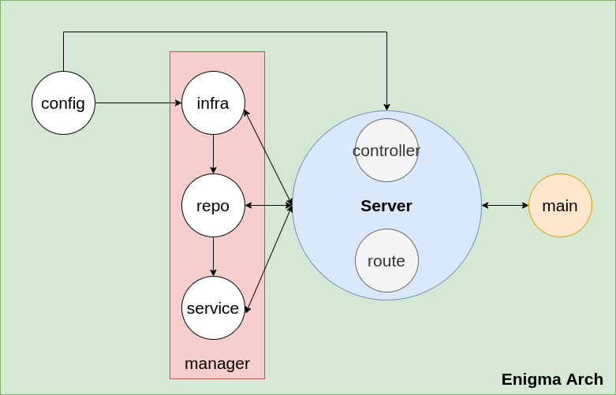
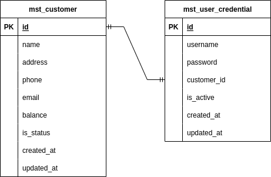
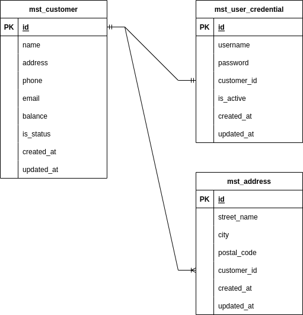
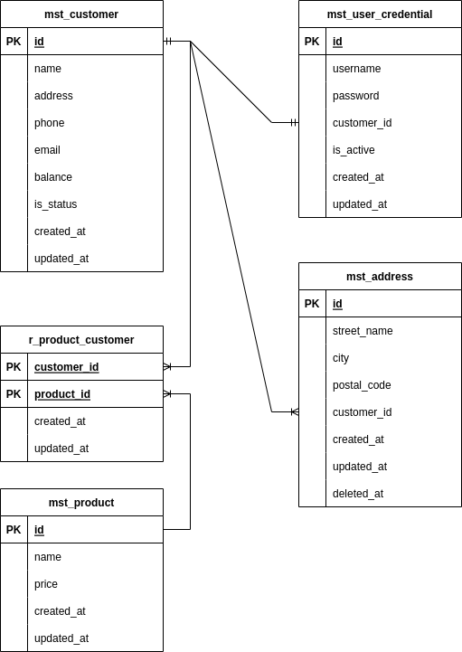

# REST API integration Node JS with
___

> - [Sequelize](https://sequelize.org/)
> - [Express](https://expressjs.com/)
> - [Node-Postgres](https://node-postgres.com/)

## Architecture project

#### Enigmart Arch

# Diagram Entity
___

#### One to One

#### One to Many

#### Many to Many

